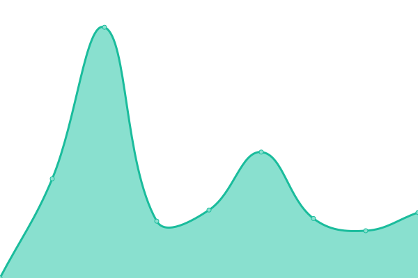

# [📈 Live Status](https://zuozuofei.github.io/fei-upptime): <!--live status--> **🟥 Complete outage**

This repository contains the open-source uptime monitor and status page for [zuozuofei](https://zuozuofei.github.io/fei-upptime), powered by [Upptime](https://github.com/upptime/upptime).

With [Upptime](https://upptime.js.org), you can get your own unlimited and free uptime monitor and status page, powered entirely by a GitHub repository. We use [Issues](https://github.com/zuozuofei/fei-upptime/issues) as incident reports, [Actions](https://github.com/zuozuofei/fei-upptime/actions) as uptime monitors, and [Pages](https://zuozuofei.github.io/fei-upptime) for the status page.

<!--start: status pages-->
<!-- This summary is generated by Upptime (https://github.com/upptime/upptime) -->
<!-- Do not edit this manually, your changes will be overwritten -->
<!-- prettier-ignore -->
| URL | Status | History | Response Time | Uptime |
| --- | ------ | ------- | ------------- | ------ |
|  [Vansatistone](https://www.vansatistone.com) | 🟥 Down | [vansatistone.yml](https://github.com/zuozuofei/fei-upptime/commits/HEAD/history/vansatistone.yml) | 

 130ms
     
 | 

<a href="https://zuozuofei.github.io/fei-upptime/history/vansatistone">0.00%</a>
    

|  [fei](https://www.fe-i.com) | 🟥 Down | [fei.yml](https://github.com/zuozuofei/fei-upptime/commits/HEAD/history/fei.yml) | 

 3441ms
     
 | 

<a href="https://zuozuofei.github.io/fei-upptime/history/fei">68.84%</a>
    

|  [feiblog](https://blog.fe-i.com) | 🟥 Down | [feiblog.yml](https://github.com/zuozuofei/fei-upptime/commits/HEAD/history/feiblog.yml) | 

 406ms
     
 | 

<a href="https://zuozuofei.github.io/fei-upptime/history/feiblog">48.96%</a>
    

<!--end: status pages-->

[**Visit our status website →**](https://zuozuofei.github.io/fei-upptime)

## 📄 License

- Powered by: [Upptime](https://github.com/upptime/upptime)
- Code: [MIT](./LICENSE) © [Anand Chowdhary](https://anandchowdhary.com), supported by [Pabio](https://pabio.com)
- Data in the `./history` directory: [Open Database License](https://opendatacommons.org/licenses/odbl/1-0/)
